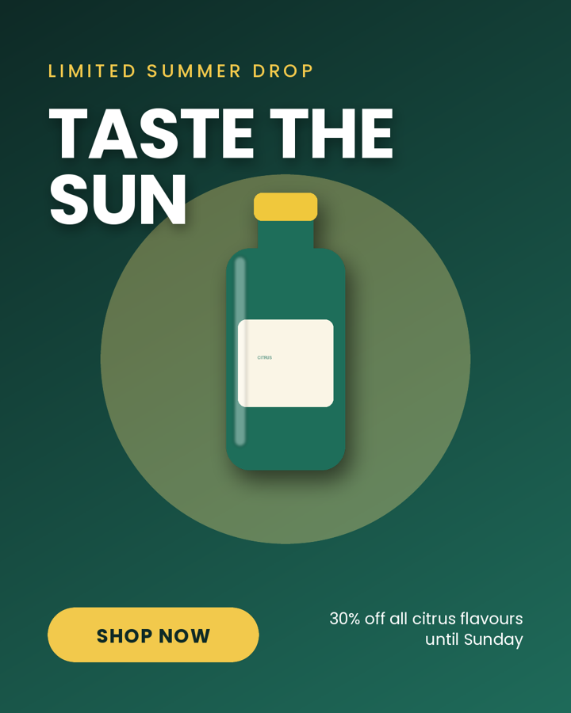
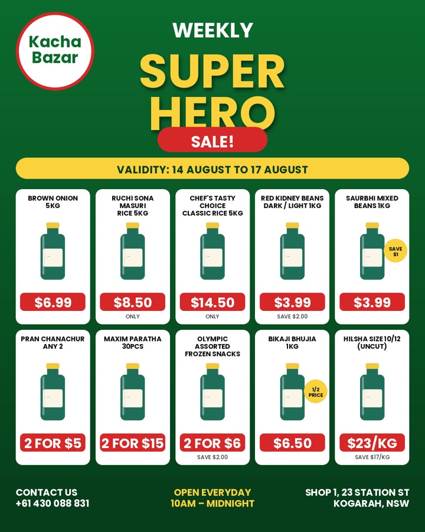
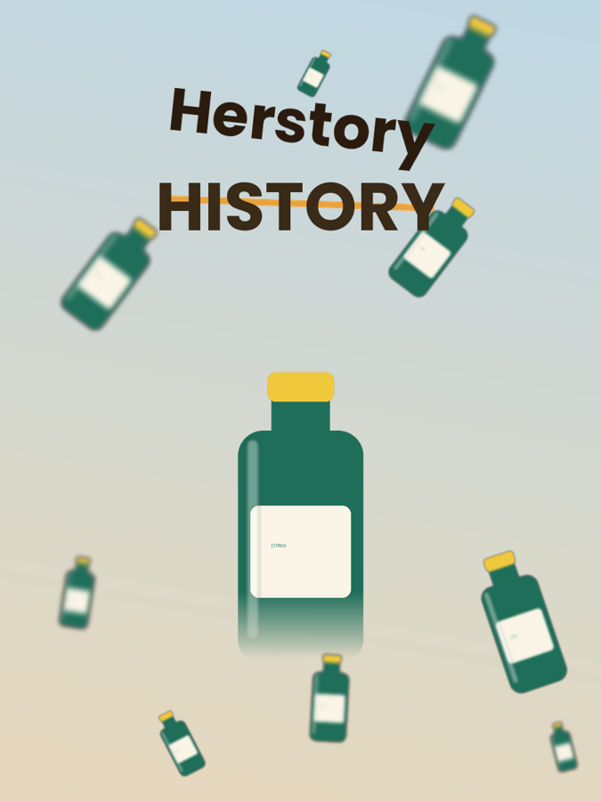
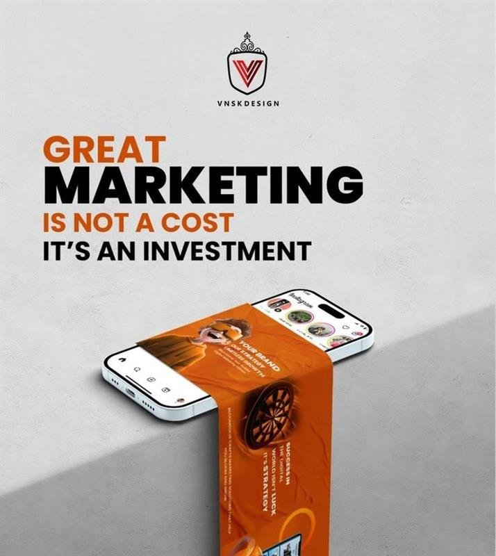
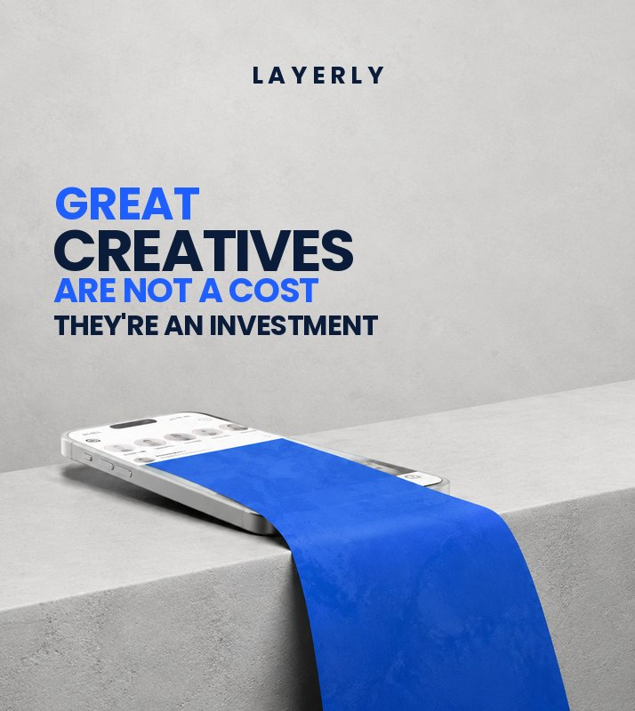
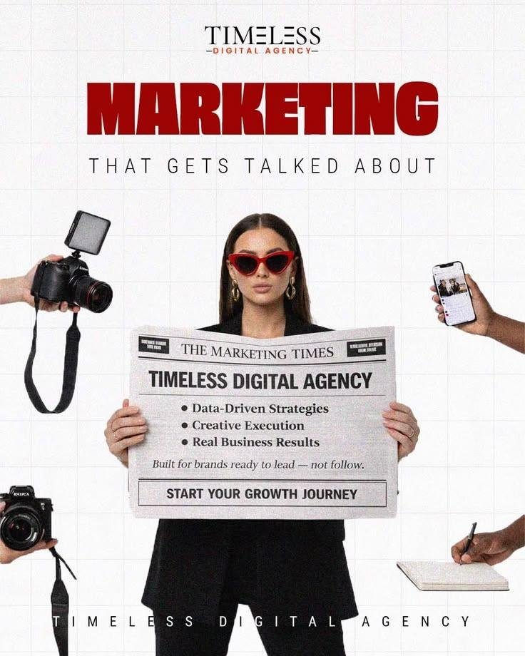
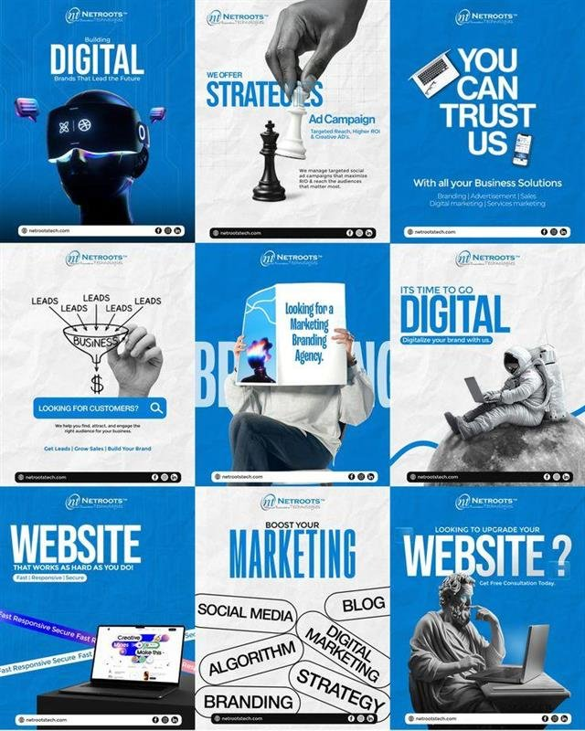
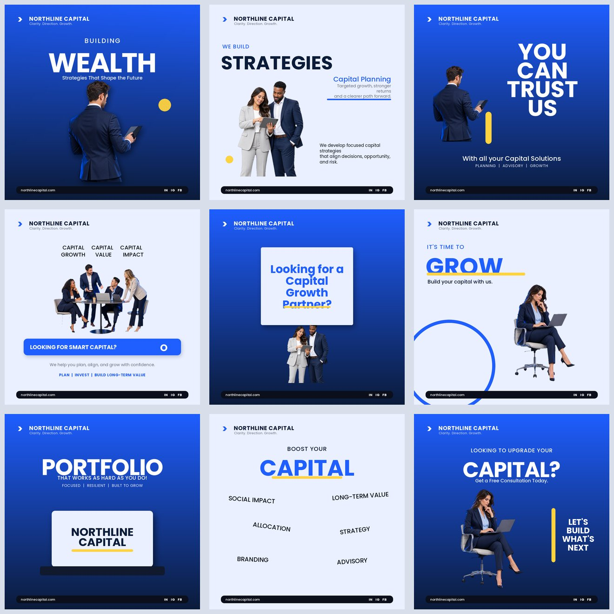
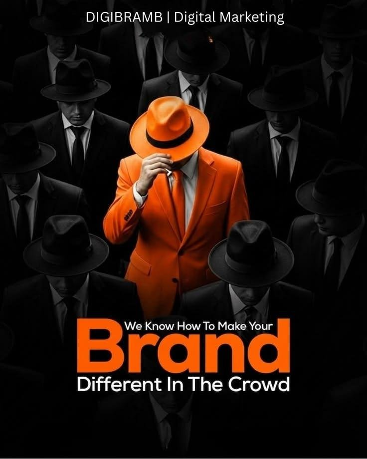
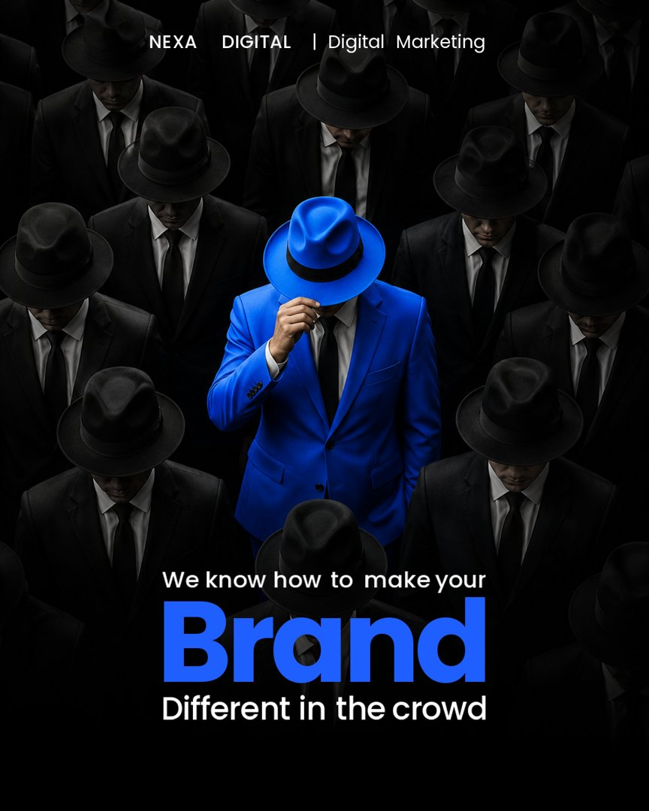

# Layerly Creatives: Social Media Creatives with Every Element on Its Own PSD Layer

A skill for AI agents that designs social media creatives, ads, flyers and posters and delivers
each one as a **layered, editable PSD**. Every ingredient of the design, the background, the
product, each line of text, each badge, button and shadow, sits on its own named layer. Not a
flat image you have to regenerate. A file your team can open and fix.

Built by Abir Hossain, founder of Sdrgrow, a social media agency in Dhaka producing weekly
creatives for grocery, retail and service brands. This is the system that came out of one
recurring problem: AI creatives look great and get one small thing wrong, and on a flat image the
only fix is to regenerate and hope. Layerly makes that fix a ten-second text edit.

Works in Claude, ChatGPT and Codex, Claude Code, Cursor, and Gemini.

| Product ad | Deals flyer | Poster |
|---|---|---|
|  |  |  |

Every element in these previews is its own named layer in the delivered PSD.

Contributions welcome. Found a way to improve the skill? Open a PR. Run into a problem? Open an
issue.

## Examples: Before and After

Real agency designs rebuilt by the skill. Each folder has the reference, the rebuilt version, the
prompt used, and the layered PSD you can open in Photopea.

| Example | Reference | Rebuilt (layered PSD) |
|---|---|---|
| [Phone banner](examples/great-creatives/) |  |  |
| [Newspaper agency ad](examples/newspaper-agency/) |  |  |
| [Nine-tile carousel](examples/nine-tile-carousel/) |  |  |
| [Brand in the crowd](examples/brand-in-the-crowd/) |  |  |

See [examples/NOTICE.md](examples/NOTICE.md) for what these are.

## What are Skills?

Skills are markdown files plus scripts that give AI agents specialised knowledge and workflows
for specific tasks. When this skill is installed, the agent recognises when you are asking for a
creative, an ad, a flyer, a poster or anything "with layers" or "as a PSD", and follows the
workflow below instead of handing you a flat picture.

## How It Works

```
                 brief + images (your photos, or images the chat generates)
                                       │
                                       ▼
                        ┌──────────────────────────────┐
                        │        layout.json           │
                        │  one entry per element:      │
                        │  text, image, shape, grid,   │
                        │  scatter, masks, effects     │
                        └──────────────┬───────────────┘
                                       │
                                       ▼
                        ┌──────────────────────────────┐
                        │      render_layers.py        │
                        │  renders every layer to PNG  │
                        │  composites preview.png      │
                        │  runs QA (overlap, contrast, │
                        │  overflow, off-canvas)       │
                        └──────────────┬───────────────┘
                                       │ QA clean
                        ┌──────────────▼───────────────┐
                        │  build_psd.js  (Node)        │
                        │  editable type layers, real  │
                        │  masks, layer styles, folders│
                        │  build_psd.py  (fallback)    │
                        └──────────────┬───────────────┘
                                       ▼
                       design.psd  +  preview.png  +  fonts
```

The agent never builds the PSD while the QA report lists a defect, and never delivers an "exact"
rebuild without looking at the audit sheet (every cutout on grey, every plate alone).

## Capabilities

| Capability | What it does |
|---|---|
| Layered PSD output | Folders per section, one layer per element, blend modes and opacity preserved |
| Editable text | Real type layers: font, size, colour, tracking, alignment, rotation |
| Layer masks | Fade, ellipse, soft rectangle or your own mask image, written into the PSD as editable masks |
| Layer styles | Drop shadows as effects, not baked pixels |
| `grid` | One block becomes a card per product: image, title, price tag, note, badge. Flyers and catalogs |
| `scatter` | Floating elements with random size, angle, blur, opacity and a keep-clear zone. Posters |
| `cleanEdges` | Removes halos and selection-outline wires from pasted cutouts |
| Rotation and blur | On any layer; tilted text stays editable |
| Built-in QA | Blocks the build while text overlaps, is unreadable, too wide or off-canvas |
| Audit sheet | Every cutout on grey and every plate alone, before an exact rebuild ships |
| Reference replication | Rebuilds a design you upload with your brand: same structure, your content |
| Exact recreation | People stay as one plate, loose objects removed with generative fill and regenerated as cutouts |
| Honesty rules | Never pastes your reference on top as a fake layer; says which assets were regenerated |
| Fonts bundled | Poppins (3 weights) and Noto Sans Bengali, OFL, subsetted; auto-switch for Bangla text |

## Playbooks

| File | What is inside |
|---|---|
| [PROMPTS.md](PROMPTS.md) | Tested prompts: smoke test, product ads, static ad sets, flyers, reference replication, exact recreation, new concepts, story covers |
| [REBRAND-PROMPTS.md](REBRAND-PROMPTS.md) | Re-skin (same design, new person, new brand, new colours) and same-concept prompts, filled in for eleven real agency designs |
| [SHOWCASE-PROMPTS.md](SHOWCASE-PROMPTS.md) | Ten showcase briefs with image-generation prompts and build briefs |
| [skills/layerly-creatives/references/layout-schema.md](skills/layerly-creatives/references/layout-schema.md) | Every layout option, presets, design rules |

## Installation

**Option 1: Claude Code plugin marketplace**
```
/plugin marketplace add Abirhossainzozo/layerly-creatives
/plugin install layerly-creatives
```

**Option 2: Skills CLI (Claude Code, Codex, Cursor)**
```bash
npx skills add Abirhossainzozo/layerly-creatives
```

**Option 3: Clone and copy**
```bash
git clone https://github.com/Abirhossainzozo/layerly-creatives.git
cp -r layerly-creatives/skills/layerly-creatives ~/.claude/skills/     # Claude Code
cp -r layerly-creatives/skills/layerly-creatives ~/.agents/skills/     # Codex / ChatGPT desktop
```

**Option 4: Zip upload (Claude, ChatGPT)**
Download `dist/layerly-creatives.zip` and upload it under Skills. Claude: Customize, Skills,
upload. ChatGPT: Skills, upload. Gemini: use `dist/layerly-creatives-gemini.zip` (Python-only build).

Careful: do NOT use the green Code, Download ZIP button; that downloads the whole repository, which Skills upload rejects. Open the `dist` folder and download `layerly-creatives.zip` itself (or find it inside the repo zip at `layerly-creatives-main/dist/`).

**Option 5: Fork and customise**
Fork the repo, swap the bundled fonts and design rules for your brand's, and install your fork.

## Usage

Once installed, ask for a creative and the agent picks the workflow:

| You say | What happens |
|---|---|
| "Instagram ad for my coffee brand, use the attached photo, give me the PSD" | Product ad, editable text, PSD |
| "Weekly deals flyer like the attached, here are the products and prices" | `grid` flyer, one folder per product card |
| "Make three static ad variants for testing" | Same skeleton, three headlines and badges, three PSDs |
| "Replicate this design with my brand" | Reference replication: same layout, your logo, colours, copy |
| "Exact recreation of this poster as real layers" | Plate plus regenerated cutouts, audit sheet before the PSD |
| "Same ingredients, new concept: checkmate at dawn" | New composition from the same assets |
| "Re-skin this flyer for Nila Mart, blue palette, new person" | Re-skin from REBRAND-PROMPTS.md |
| "Story cover with a bottom fade" | `ig-story` preset with a fade mask |

Every run ends with a preview, the QA line, and the PSD.

## Works In

| App | Install | Editable text | Notes |
|---|---|---|---|
| Claude (claude.ai, desktop) | zip upload | yes | needs code execution on |
| ChatGPT and Codex | zip upload or `~/.agents/skills/` | yes | ChatGPT generates the images too |
| Claude Code, Cursor | plugin or `npx skills add` | yes | an API key can generate images |
| Gemini | `dist/layerly-creatives-gemini.zip` | text on layers, rasterized | Python-only sandbox |

## Prerequisites

- A chat app that runs skills with code execution.
- Images come from wherever the chat can get them: ChatGPT's image tool, Nano Banana, Adobe or
  Canva connectors, or your own uploads. In a terminal, `scripts/gen_image.py` uses
  `GEMINI_API_KEY` or `OPENAI_API_KEY`.
- Node for editable type layers (dependencies are vendored, no install). Python-only environments
  fall back to pixel text automatically.
- For real branded products, always upload the real photos. Generated versions of real brands are
  wrong.

## Licensing

| Use | License | Cost |
|---|---|---|
| Personal, learning, hobby, nonprofit, education | [PolyForm Noncommercial 1.0.0](LICENSE) | free |
| Freelancer doing client work (1 seat) | [Commercial License](COMMERCIAL-LICENSE.md) | $29 / year |
| Agency (up to 10 seats) | Commercial License | $99 / year |
| Studio or in-house (unlimited seats, one company) | Commercial License | $299 / year |

Commercial licenses include the Supporter Pack (10 templates, prompt library, priority chat) and
all updates for the term. Output you create is yours forever.

**Buy a license:** https://whop.com/sdrgrow/layerly-creatives-commercial-license/

## Support the Project

Using it personally and want to say thanks?

- **Tip jar:** https://whop.com/sdrgrow/support-layerly-creatives
- **Sponsor button** at the top of this repo

## Limits, Honestly

- A flat image cannot be un-merged. Exact recreations keep people (and what they hold) as one
  plate layer, remove loose objects with real generative fill, and regenerate those objects as
  look-alike cutouts.
- Photoshop shows a one-time "update text layers" prompt on open. Click Update.
- Fonts not installed on your machine get substituted by Photoshop; the .ttf files ship next to
  every PSD.

## Contributing

PRs and issues welcome. See [CONTRIBUTING.md](CONTRIBUTING.md). Run `./validate-skills.sh` before
submitting.

## Credits

Built on [ag-psd](https://github.com/Agamnentzar/ag-psd) for PSD writing and the
[Agent Skills](https://agentskills.io) standard. Fonts: Poppins (Indian Type Foundry) and Noto
Sans Bengali (Noto Project), SIL OFL 1.1.

Abir
